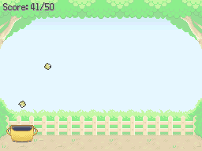

# Ball Catch Game
This script is for Pokémon Essentials. It's a simple minigame where the player must pick the balls that are falling at screen.

## Screens

## Installation
Follow the [Script](/Script.rb) instructions. The sample script files are in [Files folder](/Files).