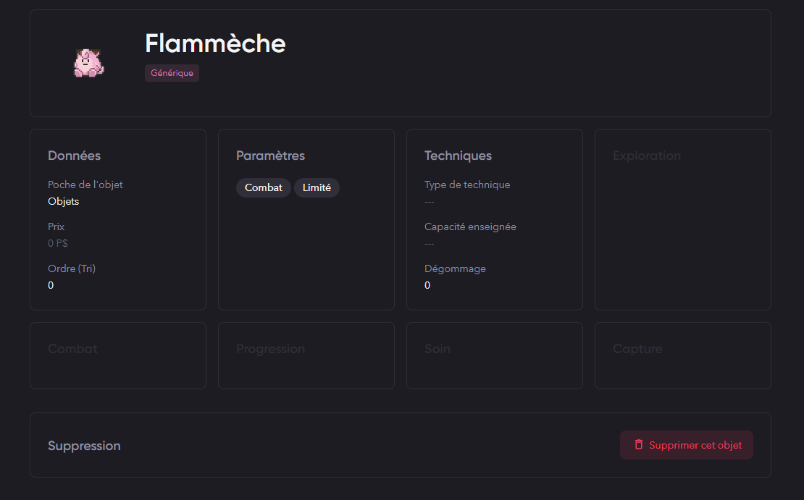
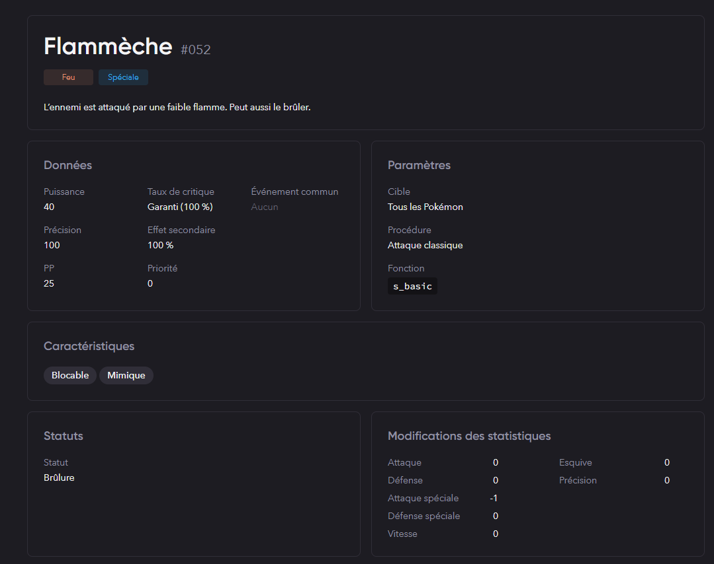

# **Capsule Corporation - Moves**

## **Description**

Ce plugin offre un cadre détaillé pour l'utilisation des objets pendant les combats dans le jeu, permettant des interactions complexes et des effets lorsque les objets sont utilisés par les dresseurs.

## **Procédure d'Installation**

1. **Télécharger le Plugin :**
   - Cloner le dépôt avec la commande :
     ```bash
     git clone https://gitlab.com/Zodiarche/capsule-corporation-move
     ```

2. **Extraire les Fichiers :**
   - Renommer le dossier en ajoutant `00001` avant `capsule-corporation-move`.

3. **Fichier CSV :**
   - Placer le fichier `.csv` dans le dossier `Data/Text/Dialogs` à la racine de votre projet.

## **Dépendances**

- **Modification de certaines fonctions :**
  - `util_item_useitem`, `item_choice`
  - Si vous utilisez un autre plugin ou script modifiant ces fonctions, il y aura une incompatibilité.

- **ID du fichier CSV :**
  - Vous ne devez pas avoir un autre fichier CSV avec l'ID 110000.

## **Comment créer mon attaque ?**

1. **Créer un Fichier :**
   - Dans `00001 ItemAttack\00001 scripts\00002 Item\00300 Definitions`, créez un fichier.
   - Exemple de contenu pour le fichier :
    ```ruby
    module PFM
      module ItemDescriptor
        class Ember < Base
        end

        define_chen_prevention(:ember) { !$game_temp.in_battle }
        define_on_attack_item_use(:ember) { |item, scene| Ember.new.proceed_internal(scene, item) }
      end
    end
    ```

2. **Configurer l'Objet dans Studio :**
   - Créez un objet comme montré ci-dessous :

   

   - Utilisez le même symbole que celui dans votre fichier Ruby comme identifiant. ("ember" dans notre cas)

   

3. **Personnaliser l'Attaque :**
   - Configurez votre attaque dans Studio et/ou personnalisez-là directement depuis le code pour des comportements    spécifiques. (l'identifiant doit également être le même, "ember" ici)

## **Support / Suggestions**

- Pour toute demande de support ou suggestion, veuillez créer une issue sur le [dépôt](https://gitlab.com/Zodiarche/capsule-corporation-move/-/issues). ***Toute demande sur Discord sera ignoré***.

## **Crédits**

- **Zøzo** : Pour toutes les mécaniques et la logique.
- **Rey** : Pour l'aide à l'amélioration du rendu visuel.
